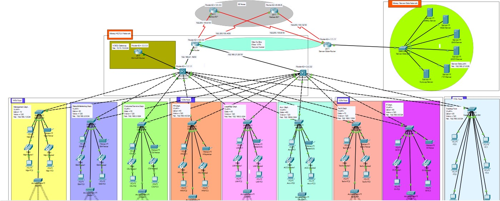

# Money Network Infrastructure Enhancement Project

## Project Overview
This documentation provides a detailed insight into the transformation of the network infrastructure of "Money," a leading financial institution. The project encompasses planning, design, and implementation steps aimed at fortifying the institution's network security, reliability, and performance.

## Introduction
Welcome to the comprehensive documentation of the "Money" network enhancement project. This project aims to revolutionize the network infrastructure of "Money," integrating advanced technologies and robust security measures to uphold the institution's reputation for excellence and integrity.

## Table of Contents
- Introduction
- Company Background
- Company Structure
- Company Requirements
- Network Planning – Network Design
- Implementation Steps
  - Step 1: Basic Setting
  - Step 2: Configure VLANs & Trunk
  - Step 3: Port Security
  - Step 4: IP Addressing
  - Step 5: Configure OSPF
  - Step 6: Configure Static IP
  - Step 7: DHCP Server
  - Step 8: Configure Inter-VLAN
  - Step 9: Configure Wireless Network
  - Step 10: Configure Telephony
  - Step 11: Configure ACL for SSH
  - Step 12: PAT + ACL
  - Step 13: Site-to-Site IPsec VPN
  - Step 14: Configure Site-Server
 
## Topology

## Contact Information
- Shaul Kabla
- NOC Engineer
- Junior
- LinkedIn: [Shaul Kabla](https://www.linkedin.com/in/shaul-kabla/)
## Conclusion
Thank you for your interest in the "Money" network enhancement project. For any inquiries or further information, please feel free to contact the project owner.
